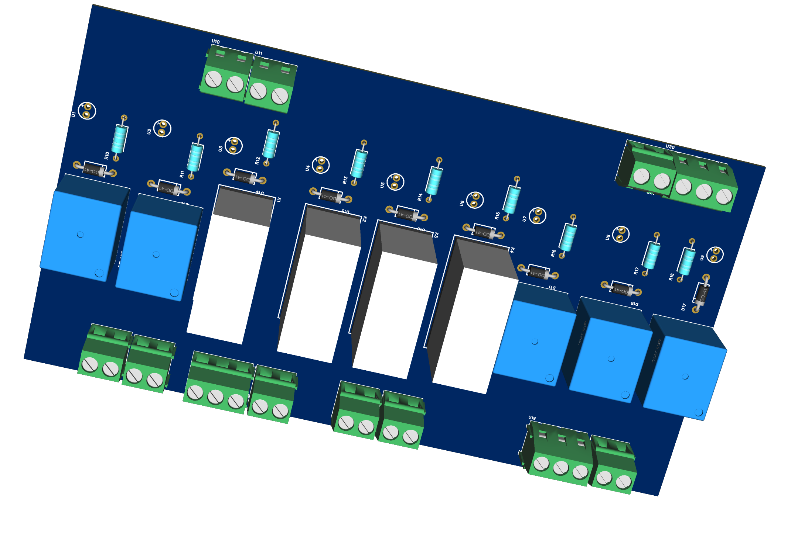
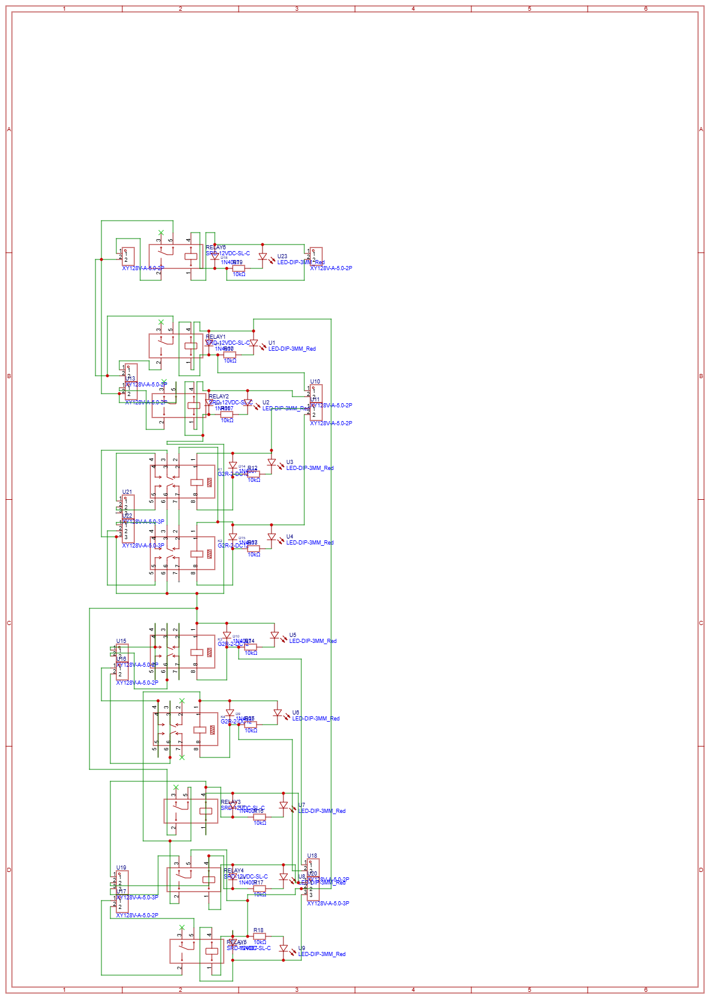

# 9-Channel Industrial Relay Card

An industrial-grade, high-reliability 9-channel relay control board designed to replace or replicate heavy-duty elevator/lift control cards. Built entirely using Through-Hole Technology (THT) to ensure maximum durability against continuous mechanical stress and vibration.

## 📸 Project Gallery

### 3D PCB Render
 

### Full Assembly & Enclosure

### PCB Layout

---

## ⚙️ Technical Specifications
* **Operating Voltage:** 12V DC (Coil side)
* **Switching Capacity:** Up to 10A / 230V AC (Load side)
* **Mounting style:** Through-Hole (Axial diodes/resistors, DIP configurations)
* **Connectors:** Heavy-duty Screw Terminals (No loose jumper wires)
* **Relay Footprint:** O/E/N 58 Standard (1.4mm hole size for thick Vicco relay legs)

---

## 🧠 Circuit Design Logic

### 1. Mechanical Stability ("Empty Pin" Logic)
To maintain the structural integrity of 5-pin industrial relays without accidentally routing power to the Normally Closed (NC) loop, a custom footprint was utilized. Pin 3 (NC) has a physical drill hole for structural mounting, but **no copper tracks are routed to it**, keeping the NC circuit electronically isolated.

### 2. Protection & Diagnostics
Every individual channel features a dedicated protection and status loop:
* **Flyback Diode (1N4007):** Placed directly across the relay coil pins (Cathode to positive rail) to suppress voltage spikes when the magnetic field collapses.
* **Coil-Side LED Indicator:** Wired in series with a 10kΩ resistor across the coil pins to provide immediate visual troubleshooting. If the LED is ON, power is safely reaching the coil.

---

## 📐 PCB Layout & Track Widths
* **Control Signals:** 0.254mm – 0.3mm
* **Power & Load Rails:** 1.5mm – 2.0mm (Widened intentionally to withstand high motor and brake startup current surges)
* **Component Spacing Grid:** 2.54mm standard layout.

---

## 🛠️ Assembly & Testing Instructions
1. **Polarity Check:** Ensure the silver band (Cathode) on the 1N4007 diodes faces the positive rail. Match the long leg (Anode) of the LEDs to the positive signal trace.
2. **Power Bench Test:** Apply 12V DC across the input terminal blocks. The diagnostic LED should illuminate instantly, accompanied by a clean, audible mechanical "click" from the corresponding relay.
